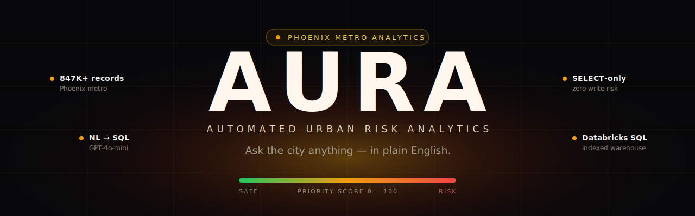
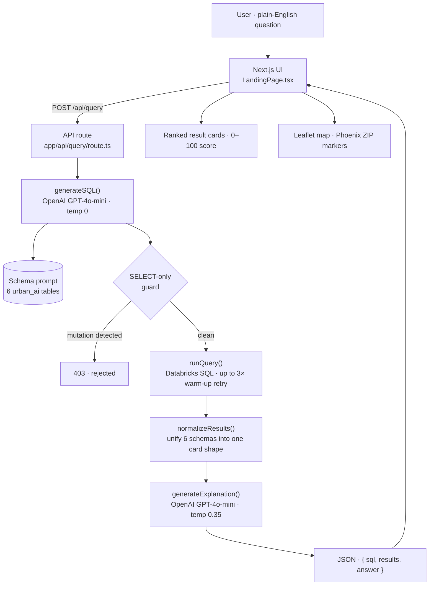
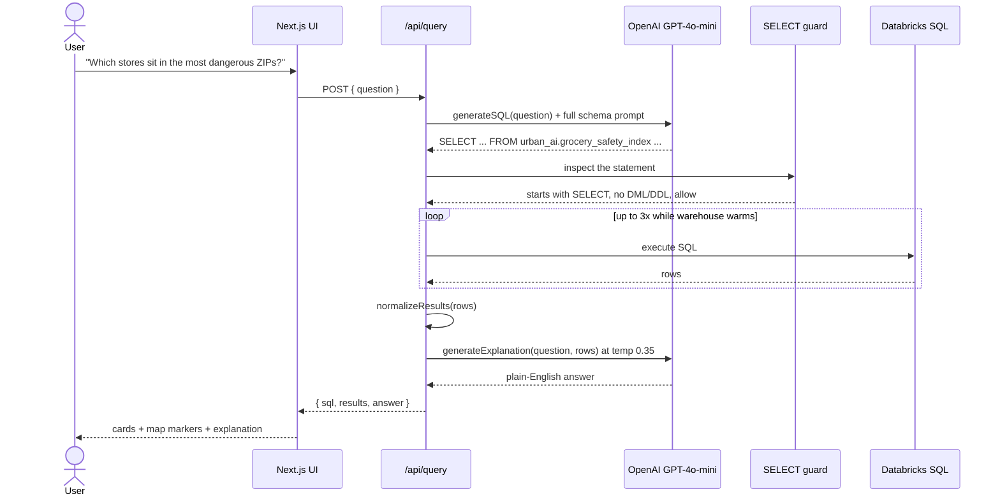
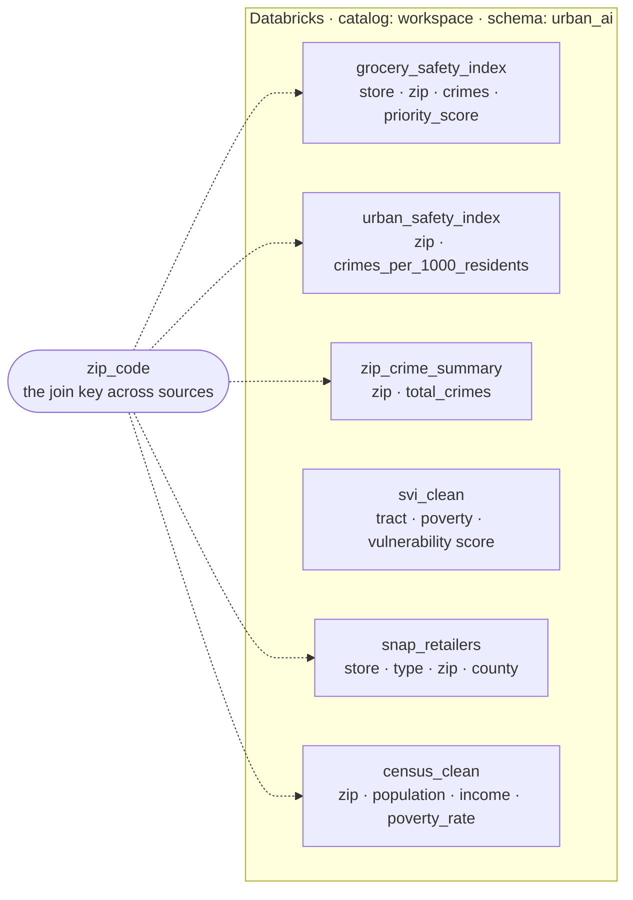
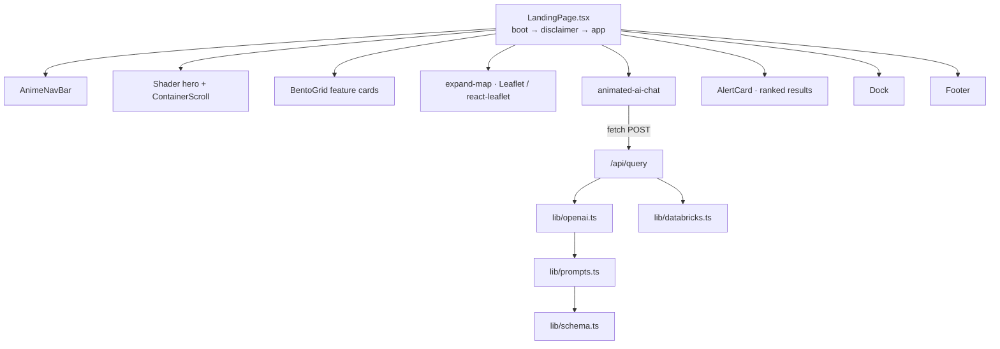

<p align="center">
  
</p>

<p align="center">
  <a href="https://urban-ai-agent.vercel.app/"></a>
  
  
  
  
  
  
</p>

<p align="center">
  <b>Ask a city safety question in plain English. Get back real data, a map, and a straight answer.</b><br>
  AURA turns natural language into governed SQL, runs it over ~847K indexed Phoenix-metro records, and explains what came back.
</p>

<p align="center">
  <a href="https://urban-ai-agent.vercel.app/"><b>► Try the live app</b></a>
</p>

---

## Contents

- [What AURA does](#what-aura-does)
- [Why I built it](#why-i-built-it)
- [Ask it things like this](#ask-it-things-like-this)
- [How it works](#how-it-works)
- [The request lifecycle](#the-request-lifecycle)
- [The data behind it](#the-data-behind-it)
- [How the frontend is wired](#how-the-frontend-is-wired)
- [Engineering decisions worth calling out](#engineering-decisions-worth-calling-out)
- [Tech stack](#tech-stack)
- [Project structure](#project-structure)
- [Run it locally](#run-it-locally)
- [Safety, on purpose](#safety-on-purpose)
- [What I'd build next](#what-id-build-next)
- [Data sources & credits](#data-sources--credits)
- [License](#license)
- [Contact](#contact)

---

## What AURA does

**AURA** (Automated Urban Risk Analytics) is a natural-language analytics tool for urban safety data. You type a question the way you'd ask a friend — *"which grocery stores sit in the most dangerous ZIP codes?"* — and AURA does three things:

1. **Translates** your question into a single, valid Databricks SQL `SELECT` statement using a schema-aware prompt.
2. **Runs** that query against a Databricks SQL warehouse holding crime, census, vulnerability, and food-access data for the Phoenix metro area.
3. **Explains** the result in plain English and plots the relevant ZIP codes on a live map — no dashboards to learn, no SQL to write.

It covers **320+ Phoenix-metro ZIP codes** across **six indexed tables**, and it is deliberately read-only: AURA can answer questions about the data, but it can never change it.

> AURA is experimental research software. Risk scores are statistical approximations — not a basis for law enforcement, policy, or operational decisions. The app says so on the way in, and so do I.

---

## Why I built it

Most "city data" lives in places normal people never look: open-data CSVs, census tables, vulnerability indices with column names like `RPL_THEMES` and `EP_UNINSUR`. The information is *public*, but it isn't *accessible* — you need SQL and patience to get a single answer out of it.

I wanted to collapse that gap. The interesting problem wasn't the dashboard; it was the middle layer: **can a language model reliably turn a vague human question into correct, safe SQL across six differently-shaped tables, and then hand the numbers back as something a person actually understands?** Getting that to behave — without it inventing columns, joining tables that shouldn't be joined, or running anything destructive — is what this project is really about.

The Phoenix metro area was a good testbed: rich open data, real variation between neighborhoods, and a clear use case (where are people most exposed, and where is help hardest to reach).

---

## Ask it things like this

These run on the live app today:

- *Which grocery stores are in the most dangerous ZIP codes?*
- *Show the top 5 highest-risk locations in Phoenix.*
- *Which areas have the lowest crime for safe transit?*
- *Find stores with high population but low crime scores.*
- *Compare crime density across different ZIP codes.*
- *Which corridors need immediate safety infrastructure?*

Each one returns ranked result cards, the underlying ZIPs pinned on a map, and a short written read on what it means.

> **Heads up:** the very first query of a session can take a few seconds — the Databricks warehouse spins up cold, and AURA retries automatically while it warms.

---

## How it works

A question makes one round trip through a single API route. The model writes the SQL, a guard checks it, Databricks runs it, and the model summarizes what came back.



The whole thing is stateless. Nothing about your question is stored — it's generated, run, explained, and forgotten.

---

## The request lifecycle

Here's the same flow as a timeline, including the two places I lean on the model and the safety check in between.



Two guards, not one: the SQL generator refuses to emit anything but a `SELECT` (and throws if it sees `DROP`, `DELETE`, `INSERT`, `UPDATE`, `ALTER`, or `CREATE`), and the API route independently re-checks that the final statement still starts with `SELECT` before it ever touches Databricks. If either fails, the request dies with a `403`.

---

## The data behind it

Six tables live under the `urban_ai` schema in Databricks. They come from different real-world sources and have wildly different shapes — the trick is that `zip_code` quietly ties most of them together, and the prompt tells the model exactly which table answers which kind of question.



Because every table scores risk on its own scale (raw `priority_score` runs from `0.17` to about `3030`, vulnerability is a `0–1` index, crime is a raw count), the API normalizes everything into one consistent `0–100` card. Priority scores in particular go through a **log scale** so the mid-range isn't all squashed at the bottom — `0.17 → 0`, `139 → 53`, `858 → 79`, `3030 → 100`. That normalizer is the single most important function in the codebase: it's what lets six schemas render as one clean list.

| Table | Answers questions about | Key columns |
|---|---|---|
| `grocery_safety_index` | which stores sit in safe vs. dangerous areas | `store_name`, `zip_code`, `total_crimes`, `priority_score` |
| `urban_safety_index` | ZIP-level risk, corridors, infrastructure | `zip_code`, `crimes_per_1000_residents` |
| `zip_crime_summary` | raw crime counts per ZIP | `zip_code`, `total_crimes` |
| `svi_clean` | poverty, unemployment, uninsured, vulnerability | `EP_POV150`, `EP_UNEMP`, `EP_UNINSUR`, `RPL_THEMES` |
| `snap_retailers` | food access and food deserts | `Store Name`, `Store Type`, `Zip Code` |
| `census_clean` | population, income, housing | `zip_code`, `population`, `median_income`, `poverty_rate` |

---

## How the frontend is wired

The landing page is a small state machine — `boot → disclaimer → app` — composed from a set of focused UI components. The chat is the only thing that talks to the backend.



The map isn't decorative: AURA carries a lookup of ~150 Phoenix-metro ZIP centroids, so any ZIP that shows up in a result lands as a real marker on the map.

---

## Engineering decisions worth calling out

| Decision | Why |
|---|---|
| **Schema lives in the prompt, not in code** | The model gets the exact tables, columns, ranges, and "use this table when…" routing as a system prompt. Adding a dataset means editing one schema file, not rewriting query logic. |
| **`temperature: 0` for SQL, `0.35` for the explanation** | SQL has to be deterministic and correct; the human-facing summary is allowed a little warmth so it doesn't read like a robot. |
| **Two independent SELECT guards** | One inside the SQL generator, one in the API route. A single check is a single point of failure; defense in depth costs nothing here. |
| **3× retry on the warehouse** | Serverless Databricks warehouses sleep to save cost and wake slowly. Rather than fail the first query of a session, AURA retries with a 2.5s backoff while the cluster spins up. |
| **A fresh Databricks client per request** | The client is created and fully torn down (operation → session → client) inside each call, so sessions never leak and idle compute is released. |
| **One normalizer, six schemas** | `normalizeResults()` detects which table a row came from and maps it onto a single card shape, so the frontend only ever renders one thing. |
| **No JOINs, no subqueries** | The prompt forbids them. Each question maps to exactly one table — simpler to reason about, far harder for the model to get wrong. |

---

## Tech stack

| Layer | Choice |
|---|---|
| Framework | Next.js 16 (App Router) + React 19 |
| Language | TypeScript |
| Styling / motion | Tailwind CSS v4, Framer Motion (`motion`) |
| Maps | Leaflet + react-leaflet, Mapbox GL |
| AI | OpenAI GPT-4o-mini |
| Data warehouse | Databricks SQL (`@databricks/sql`) |
| Icons | lucide-react |
| Hosting | Vercel |

---

## Project structure

```text
urban-ai-agent/
├── app/
│   ├── api/query/route.ts     # the one endpoint: NL -> SQL -> guard -> run -> explain
│   ├── layout.tsx             # metadata, fonts
│   └── page.tsx               # renders <LandingPage />
├── src/
│   ├── components/
│   │   ├── LandingPage.tsx    # boot -> disclaimer -> app state machine
│   │   └── ui/                # navbar, hero shader, bento grid, map, chat, dock, footer
│   └── lib/
│       ├── openai.ts          # generateSQL, generateExplanation, normalizeResults
│       ├── databricks.ts      # connect, run, tear down per request
│       ├── prompts.ts         # the SQL + explanation system prompts
│       ├── schema.ts          # the six-table schema the model reads
│       └── types.ts
├── public/                    # video background, icons
└── docs/assets/               # README art
```

---

## Run it locally

You'll need a Databricks SQL warehouse and an OpenAI API key.

```bash
git clone https://github.com/SikeTheMike/urban-ai-agent.git
cd urban-ai-agent
npm install
```

Create a `.env.local` in the project root:

```bash
OPENAI_API_KEY=sk-...
DATABRICKS_HOST=your-workspace.cloud.databricks.com
DATABRICKS_HTTP_PATH=/sql/1.0/warehouses/xxxxxxxxxxxx
DATABRICKS_TOKEN=dapi-...
```

Then:

```bash
npm run dev
```

Open [http://localhost:3000](http://localhost:3000). The `.env.local` is git-ignored — keys never leave your machine.

> AURA expects the six tables above to already exist under an `urban_ai` schema in your Databricks workspace. Point it at your own warehouse and adjust `src/lib/schema.ts` to match your columns.

---

## Safety, on purpose

This is a tool that talks about crime and vulnerability, so the guardrails aren't an afterthought:

- **Read-only by construction** — two layers reject anything that isn't a `SELECT`. AURA cannot write, modify, or drop data even if the model tried.
- **No query persistence** — questions are processed in real time and never stored.
- **An honest front door** — the app opens with a disclaimer that says, plainly, that it's experimental and *not* for law enforcement, policy decisions, or public-safety determinations. I'd rather under-promise.

---

## What I'd build next

- **Query caching** so the same question doesn't re-hit the warehouse (and so the cold cluster gets warm-started behind a tiny cache).
- **Confidence + provenance** on each answer — show which table and rows produced it, inline.
- **More cities.** The architecture is city-agnostic; the only city-specific pieces are the schema and the ZIP centroid map.
- **An evals harness** — a fixed set of questions with expected SQL, run on every deploy, so prompt tweaks can't silently regress.
- **Streaming explanations** instead of waiting for the full completion.

---

## Data sources & credits

AURA indexes open public datasets for the Phoenix metro area:

- **Crime incident data** — City of Phoenix open data
- **US Census** — population, income, poverty (American Community Survey)
- **Social Vulnerability Index** — CDC/ATSDR SVI (`EP_*`, `RPL_THEMES` fields)
- **SNAP authorized retailers** — USDA SNAP Retailer Locator
- **Grocery / store locations** — joined to crime by ZIP

All datasets are public; AURA only reads indexed copies.

---

## License

Released under the [MIT License](LICENSE).

---

## Contact

**Zain Sahir Shah**

[](https://linkedin.com/in/zain-sahir-s-4b1a9a227)
[](https://github.com/SikeTheMike)
[](mailto:shahzain.zeza@gmail.com)

If you're reading the code and something's unclear, open an issue or reach out — always happy to walk through it.
